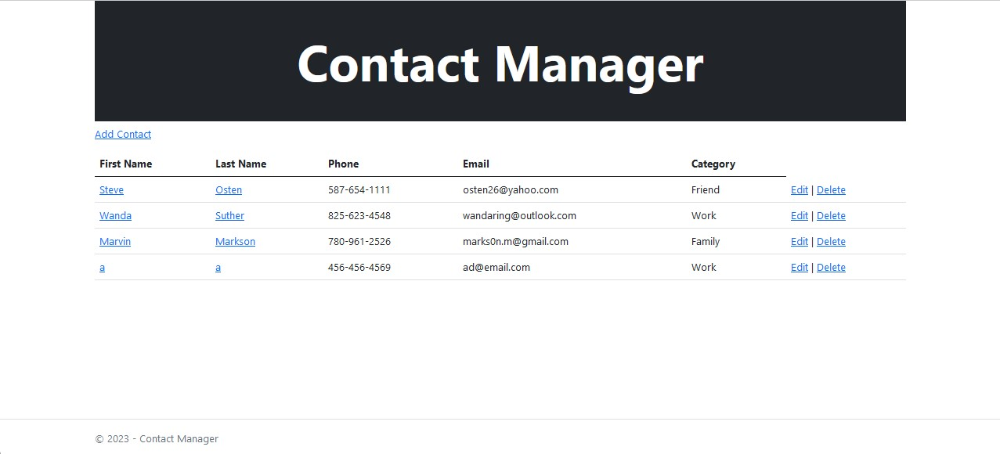
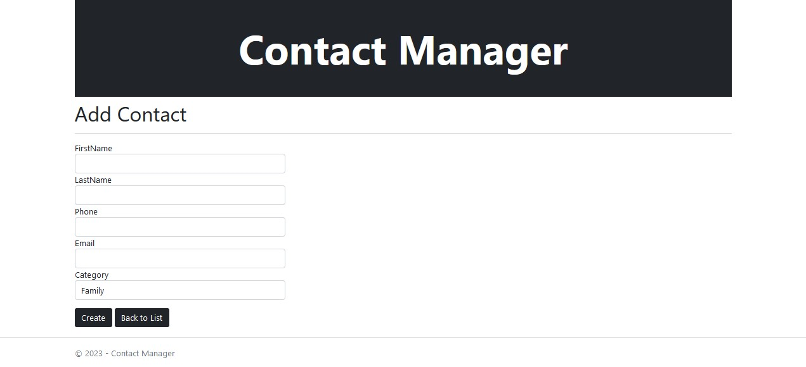
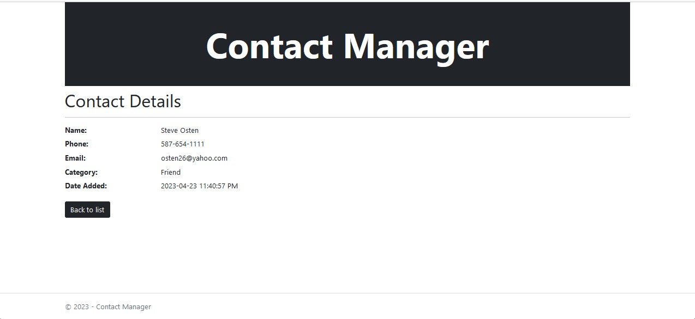
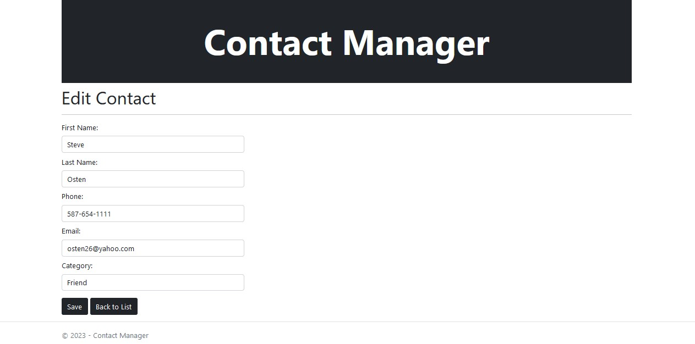
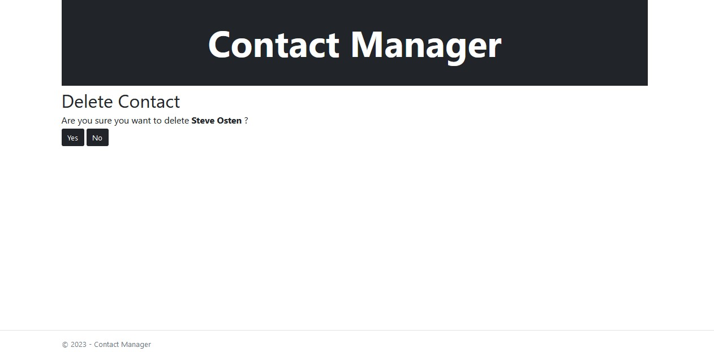

# ContactManagerMVC
> A website to manage Contacts with the ability to view existing and modify or delete contacts, as well as creating new ones (inspired by a product list or a movie list where a person is able to add a new product with details and enlist under a certain category)

## Table of Contents
* [General Info](#general-information)
* [Technologies Used](#technologies-used)
* [Screenshots](#screenshots)
* [Setup](#setup)

## General Information
- Contact Manager intented to allow users to view and add contacts (a user would be the agent)
- Intended to create a user experience to provide a platform that displays the current contacts and be able to add or modify
<!-- You don't have to answer all the questions - just the ones relevant to your project. -->

## Technologies Used
- Bootstrap 5
- jQuery JS library 3.6
- Microsoft .NET
- C# 
- HTML5
- CSS

## Screenshots

Main Page
 

Add Contact Page
 

Contact Details Page
 

Edit Contact Page
 

Delete Contact Confirmation
 

## Setup
after downloading all files in the repo (Visual Studio was used to build and run the Web App)
- then start ContactManagerMVC.sln file
- set ContactManagerData library as Startup project
- go to Project Manager Console and make sure the default project is set to ContactManagerData
- cope and paste this scaffold in PM console Scaffold-DbContext -Connection "Data Source=localhost\sqlexpress;Initial Catalog=TravelExperts;Integrated Security=True;Encrypt=False" -Provider Microsoft.EntityFrameworkCore.SqlServer -Context ContactssContext -OutputDir "look up where the TravelExpertsData folder is, right click and copy as path to paste here" -DataAnnotations
- now after it says complete make sure to set the ContactManagerMVC project back as start up project
- Run the program and you should be able to navigate trough the page

## Thank you for reading
